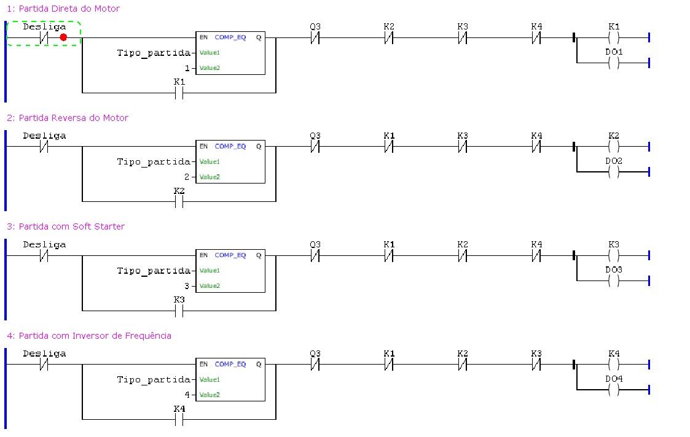

# BancadaCLP
Este repositório contém os arquivos de programação e simulação para o controle de motores elétricos utilizando uma bancada didática com o CLP 300 da WEG. As partidas utilizadas foram: Partida Direta, Partida com Reversão, Partida com Soft Starter e Partida com Inversor de Frequência.

## 🎯 Objetivos

O Objetivo principal desse repositório é arquivar os documentos envolvendo a montagem da bancada CLP para o laboratório de Máquinas Elétricas da Universidade Federal do Oeste da Bahia, mantendo como um posterior guia para alunos utilizarem e implementarem melhorias a bancada.

## 🛠️ Ferramentas Utilizadas

- Software de Programação: WEG Programming Suite (WPS)
- Software de Simulação: CADe SIMU (Versão 3.0 ou superior)

## 📑 Programação e Simulação

A programação do projeto foi feita por meio da linguagem Ladder no software WEG Programming Suite (WPS), que é uma linguagem de fácil interpretação e implementação em CLPs. A ideia básica é ter um CLP controlando as partidas dos motores via comutadores ou partidas eletrônicas, tudo isso controlado via uma IHM. A simulação demonstra esse cenário por meio de um CLP, botões, motores, comutadores, partidas eletrônicas e sinalizadores (LEDs). Para acessar o arquivo da programação Ladder basta instalar o WEG Programming Suite, após a instalação, abrir uma configuração que se encontra dentro da pasta documents/PCL300. Para rodar a simulação, basta ter o executável do CADe SIMU, inserir a senha (geralmente é 4962), abrir o arquivo .cad que se encontra na pasta documents do repositório e rodar.

## :camera: Imagens

Aqui se encontra documentado partes do arquivo do WPS e CADe SIMU separado por secções:

### Parte dos motores no WPS

  

## ▶️ GIF da Simulação

Gif da Simulação no CADe SIMU de uma partida direta e o eventual desligamento da mesma.

  

